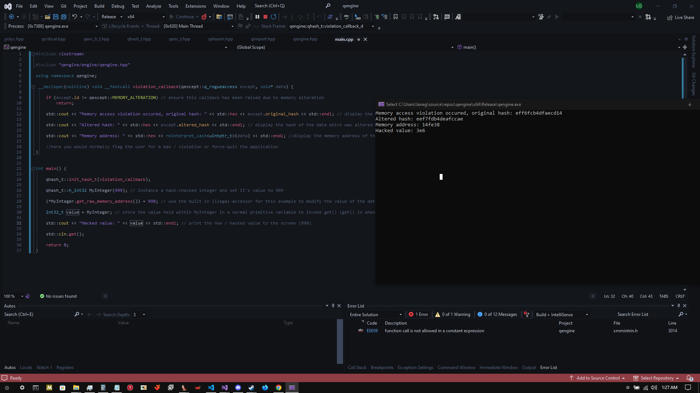
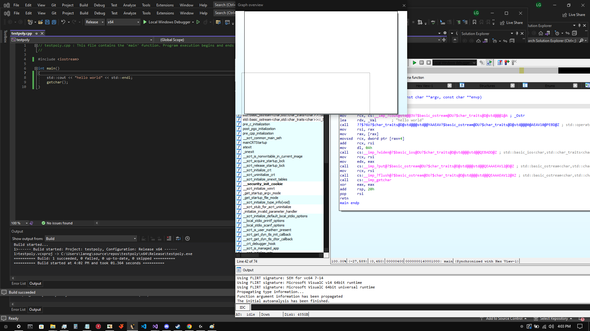
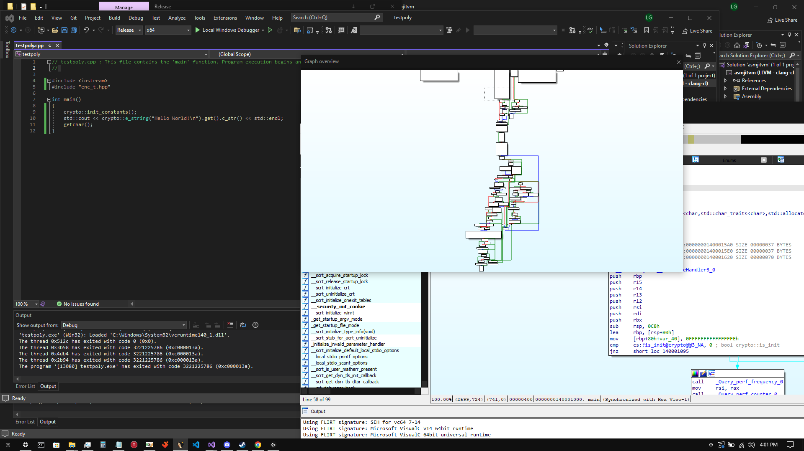

# - qengine - 

Easy to use and highly configurable, compiler-independent, fully inlined binary obfuscation for C++ windows applications

--------------------------------------------------------------------------------------------------------------------------------------------------------------------------------------------------------------

## Features

* Runtime stack polymorphism (locals will be manipulated directly on the stack and appear differently each execution, not really a big deal as this happens in most applications anyways)
* Runtime heap polymorphism (dynamic polymorphic allocations are supported, not a big deal as above)
* Thorough control-flow obfuscation (depending on compiler used and amount of library types used, IDA control-flow graph will be extremely difficult to read and in many cases fail pseudo-code generation)
* Cumbersome conditional branching (extended memory check obfuscation e.g create indirection for checking valuable information such as product keys etc.)
* .text / executable section Polymorphism (.text section dumps will appear different at each runtime which would hypothetically prevent basic static .text dump signature scans by AV's / AC's etc.)
* PE header wipe / mutation (headers will be wiped or appear different at each runtime)

--------------------------------------------------------------------------------------------------------------------------------------------------------------------------------------------------------------

## What is qengine?

qengine is a polymorphic engine (meaning an engine that takes multiple forms / permutations) for windows with the end goal of making the reverse engineers day much more difficult, and making the binary appear as unique as possible and unrecognizable at each independent runtime.

i couldn't find a good solution - llvm-obfuscator only supports llvm / clang, vmprotect / themida are proprietary solutions which offer little in terms of control over the process of obfuscation and other options tend to have the same issue - 

i couldn't control the way my binary was obfuscated the ways in which i wanted to.

--------------------------------------------------------------------------------------------------------------------------------------------------------------------------------------------------------------

This library is fairly well tested (considering i am a one-man team) - i currently am unaware of any bugs for LLVM / CLANG, MSVC, and Intel compiler targets for both x86 and x64 release builds.

This will NOT prevent static disk-signatures of your executables - however, it will make the task of understanding your code from a classic disassembler such as IDA nearly impossible if used properly, and will prevent memory-dump / memory-scan based signature detections of your binary.

This class is fully inlined, employing minimalist design and maximum performance + reliability -

Obfuscation and polymorphism can be heavy in terms of performance cost, howver on 

~1.70% average performance loss vs standard library / primitive types, likewise you will retain ~98.3% of your programs original performance ( on average )

If anyone is able to contribute detailed benchmarks if they have the time, this would be extremely helpful - my hands are tied when it comes to free time for this project at the moment.

--------------------------------------------------------------------------------------------------------------------------------------------------------------------------------------------------------------

## Usage

* Download the repository as a zip file, and extract the qengine folder to your project's main / root directory
* Include the qengine header file contained in <root_directory>/qengine/engine/

### Hello World

Here is the obligatory "Hello World" for qengine:

```cpp
#include <iostream>

#include "qengine/engine/qengine.hpp"

using namespace qengine;

int main() {
	std::cout << qenc_t::e_string("Hello World!").get() << std::endl; // dynamically encrypted type(s)

	std::cout << qhash_t::h_string("Hello World!").get() << std::endl; // secured / hash-checked type(s)

	std::cout << qenc_h_t::q_string("Hello World!").get() << std::endl; // dynamically encrypted AND hash-checked type(s)

	std::cin.get();

	return 0;
}
```

* All types contained in the qenc_t and qenc_h_t namespace's are encrypted using a polymorphic encryption algorithm and decrypted only when accessed, then re-encrypted. 

* All types contained in the qhash_t and qenc_h_t namespace's are hashed using a high-performance 32 or 64-bit hashing algorithm i made for this purpose.

### Cumbersome Conditional Branching

Here is an example of creating an obfuscated conditional branch which evaluates two variables for the specified conddition, and executes the callback function corresponding to the outcome:

```cpp
#include <iostream>

#include "qengine/engine/qengine.hpp"

using namespace qengine;

void true_() {

	std::cout << "condition is true" << std::endl;
}

void false_() {

	std::cout << "condition is false" << std::endl;
}


int main() {

	int x = 1;
	int y = 1;

	qcritical::SCRAMBLE_CRITICAL_CONDITION(
		true_,				// callback if condition evaluates to TRUE
		false_,				// callback if condition evaluates to FALSE
		std::tuple<>{},     // arguments (if any) for TRUE evaluated callback (our callback has no arguments)
		std::tuple<>{},		// arguments (if any) for FALSE evaluated callback (our callback has no arguments)
		x, y,				// our condition variables from left -> right order (can be of any primitive type or std::string / std::wstring type for now)
		qcritical::EQUALTO  // evaluation type (less than, greater than, equal to, greaterthanorequalto etc. )
	);

	return 0;
}
```

The above program outputs "condition is true" to the screen - the above example is optimized in release build, and if you want to see the real-world results on control flow this will have, you should use non-const comparison values e.g time_since_epoch etc.

When i get time i will upload a more in-depth analysis including screen-shots of the way which the cumbersome conditional branching obfuscates control-flow, but to summarize - 

* Multiple complex sub-routines are generated by the compiler as opposed to two basic ones for true / false evaluations
  
AND

* Each sub-routine contains multiple iterations of cmp / test instructions rather than a single cmp / test instruction as the compiler would normally generate and is beyond trivial to crack using a debugger.

### Memory Hash-Check Violation Handling

This library allows you to handle the event where a debugger or external tool attempts to illicitly write data to the stack / heap which corrupts / change any of your variables. 

Below i will give an example of how to create a callback function to handle this event, assign it to the library, and trigger it yourself to test it -

```cpp
#include <iostream>

#include "qengine/engine/qengine.hpp"

using namespace qengine;

 __declspec(noinline) void __fastcall violation_callback(qexcept::q_rogueaccess except, void* data) {

	if (except.id != qexcept::MEMORY_ALTERATION) // ensure this callback has been raised due to memory alteration
		return;

	std::cout << "Memory access violation occured, original hash: " << std::hex << except.original_hash << std::endl; // display the original hash of the data when it was valid

	std::cout << "Altered hash: " << std::hex << except.altered_hash << std::endl; // display the hash of the data which was altered

	std::cout << "Memory address: " << std::hex << reinterpret_cast<uintptr_t>(data) << std::endl; //display the memory address of the data which was altered 

	//here you would normally flag the user for a ban / violation or force-quit the application
}


int main() {

	qhash_t::init_hash_t(violation_callback); // assign our callback function to the namespace - all instances will refer to this callback if they detect a violation

	qhash_t::h_int32 MyInteger(999); // instance a hash-checked integer and set it's value to 999

	(*MyInteger.get_raw_memory_address()) = 998; // use the built in illegal-accessor for this example to modify the value of the data and trigger our callback

	int32_t value = MyInteger; // store the value held within MyInteger in a normal primitive variable to invoke get() (get() is when the check will occur)

	std::cout << "Hacked value: " << value << std::endl; // print the new / hacked value to the screen (998)

	std::cin.get();

	return 0;
}
```

Below is a screenshot of the resulting output from the above code:



## - Hashing -

To address the reliability of the hashing algorithm(s), i made a collision testing application which will be included in the repo which tests for collisions amongt all possible permatations of a 2-byte / 16-bit data set using both algorithm's, the results are:

qhash32 algorithm (32-bit) - 0.0000000233% collision rate amongst 65535 unique 16-bit datasets (1 collision), which is the same rate as crc32
qhash64 algorithm (64-bit) - 0.0% collision rate amongst 65535 unique 16-bit datasets (0 collisions)

--------------------------------------------------------------------------------------------------------------------------------------------------------------------------------------------------------------

## Demonstration of control flow obfuscation:

- Basic "Hello, World!" application before polymorphic type -
- 


--------------------------------------------------------------------------------------------------------------------------------------------------------------------------------------------------------------

- Basic "Hello, World!" application after polymorphic type -
(the control flow chart gets more and more messy, the more instances of polymorphic types are instantiated)



--------------------------------------------------------------------------------------

### Notes

* If you are concerned about external manipulation of your application, the hash-checked types in the qenc_h_t and qhash_t namespace's allow you to specify a callback routine which will be triggered if a variable you instanced from these namespaces is midified through a debugger or WriteProcessMemory etc. 

```cpp
#include "enc_t.hpp"

int main(){
  crypto::init_constants(); // initialize the namespace
  
  // use the namespace throughout application now
  return 0;
}
```

* Extended types (SSE / AVX) must be enabled in your project settings if you wish to use the derived polymorphic versions of them.

* When using the e_malloc class to allocate dynamic blocks of memory, i suggest using the UNIQUE macro as such, unless you wish to manually call free() subsequently for every get() call:
```cpp
e_malloc e_malloc_instance(insert_allocation_size); // instantiate polymorphic memory block

auto unique_block_pointer = UNIQUE(e_malloc_instance.get()); // get unique_ptr to memory block (macro will apply custom Decommission object for malloc / free)

// use unique_block_pointer - it will prevent memory leaks on it's own when it goes out of scope
```


--------------------------------------------------------------------------------------

__--TO-DO / GOALS--__

* optimize the e_malloc class - it is the one class here that is terrible performance heavy during runtime and currently, unless used with the UNIQUE macro, prone to memory leaks
* strengthen XOR encryption algorithm and further randomize seeding method, to make this harder than it currently is to reverse.

