<p align="center">
  
</p>
<p align="center" style="font-size: 20px; font-weight: bold;">
                                         		qengine 
</p>


qengine is a Header-Only, Highly Configurable, Compiler-Independent, and largely inlined Binary Obfuscation Toolkit designed for C++ Standard 17 (or higher) Applications for Microsoft Windows. qengine offers ease of use while making your code extremely difficult to understand, especially for classic disassemblers like IDA.

If you are interested in security testing qengine, or downloading further example usage of qengine, please refer to the Research and Development Repository which contains official template projects for these purposes:

[ qengine Research & Development Branch ](https://github.com/Chemiculs/qengine-researchanddevelopment)

---------------------------------------------------------------------------------------------------------------------------------------------------------------------------------------------------------------

<details>
<summary>What is qengine?</summary>

--------------------------------------------------------------------------------------------------------------------------------------------------------------------------------------------------------------

qengine is a polymorphic engine (meaning an engine that takes multiple forms/permutations) created for the Microsoft Windows operating system, designed to make reverse engineering significantly harder. 

This project aims to make binaries appear as unique and unrecognizable as possible at each independent execution.


* qengine is fairly well tested (considering we are a small team) - I currently am unaware of any bugs for LLVM / CLANG, MSVC, and Intel compiler targets for both x86 and x64 release builds.

* This will NOT prevent static disk signatures of your executables - however, it will make the task of understanding your code from a classic disassembler such as IDA VERY difficult if used properly, and will prevent memory-dump / memory-scan-based signature detections of your binary.

* This library is (almost) fully inlined, employing a minimalist design and maximum performance + reliability, function inlining allows qengine to hide the actual code you are executing behind a wall of cryptographic instructions and protected memory regions

qengine is very lightweight and incurs a ~1.70% average performance loss vs. standard library / primitive types, likewise you will retain ~98.3% of your application's original performance ( on average ) while simultaneously generating thousands or even millions of junk instructions dilluting your meaningful compiled codebase 

If anyone is able to contribute further detailed benchmarks if they have the time, this would be extremely helpful - my hands are tied when it comes to free time for this project at the moment.

</details>

--------------------------------------------------------------------------------------------------------------------------------------------------------------------------------------------------------------

<details>
<summary> Is qengine Malicious? </summary>

--------------------------------------------------------------------------------------------------------------------------------------------------------------------------------------------------------------

This is a perspective which i have been approached with several times to date and will likely wind up being subject to criticism of eventually (should this project continue to thrive and advance, ofcourse).

I will say that at the moment, while this engine is interesting and powerful, it is not really currently much more effective than many other ( Virtualized ) obfuscation software(s) with VMProtect and Themida likely out-doing qengine in terms of protection of original code by a decent margin.

qengine employ's it's own methods of mutation and  similar to other Obfuscation / Virtualization software(s), albeit much less aggressively and entirely optionally, currently only in very specific manners as well which could probably be constrained to a heuristic trait detection eventually.

This project does however, if it has the potential which i believe it may, this could end up becoming something capable of significantly polluting the software ecosystem for a good while - whether this ends up happening or not only time will tell.

</details>

--------------------------------------------------------------------------------------------------------------------------------------------------------------------------------------------------------------

<details>
<summary>Features</summary>

--------------------------------------------------------------------------------------------------------------------------------------------------------------------------------------------------------------

* Runtime stack  ( locals will be manipulated directly on the stack through compiler-generated junk code, and will be encrypted with a dynamic key and algorithm decided at each execution )

  
* Runtime heap polymorphism ( polymorphic heap allocations are supported )

  
* Thorough control-flow obfuscation ( depending on the compiler used and amount of library types used, the IDA control-flow graph will be extremely difficult to read and in many cases fail pseudo-code generation )

  
* Cumbersome conditional branching ( extended memory check control flow branching e.g. create indirection for checking valuable information such as product keys etc. )

  
* .text / executable section Polymorphism ( .text section dumps will appear different at each runtime which would hypothetically prevent basic static .text dump signature scans by AV's / AC's etc. )

  
* PE header wipe/mutation ( headers will be wiped or appear differently at each runtime, in memory )

  
* Dynamic / Runtime imports ( hide imports from disk PE image import table )

</details>

--------------------------------------------------------------------------------------------------------------------------------------------------------------------------------------------------------------

<details>
<summary>Setup / Usage</summary>

--------------------------------------------------------------------------------------------------------------------------------------------------------------------------------------------------------------

### ** NOTE: This setup option only works out of the box targetting the MSVC v143 compiler WITH the "Runtime Library" Option set to the default " Multi-threaded DLL (/MD) " build target.

if you wish to target another compiler or Runtime Library version, you MUST first compile [ASMJIT](https://github.com/asmjit/asmjit) and [Capstone](https://github.com/capstone-engine/capstone) from their source(s), with the according compiler settings from your target project applied and then replace the library files output with the according target output filename(s) in the <root_directory>/qengine/engine/extern/ folder :

```cpp

asmjit32.lib	//	32-bit release static library build for asmjit

asmjit64.lib	//	32-bit release static library build for asmjit

asmjit_d32.lib	//	32-bit release static library build for asmjit

asmjit_d64.lib	//	32-bit release static library build for asmjit

capstone32.lib	//	32-bit release static library build for capstone

capstone64.lib	//	64-bit release static library build for capstone

```

IF you are simply using MSVC Compiler v143 or higher, you will NOT need to worry about the above step.

* Download the repository as a zip file, and extract the /src/qengine folder to your project's main / root directory
  
* goto <root_directory>/qengine/extern/ and unzip "asmjit_libs.zip"  - make sure all the files within are extracted to this directory
  
* Include the qengine header file contained in <root_directory>/qengine/engine/
  
* Add <root_directory>/qengine/extern/ to additional library directories (for linking)

</details>

--------------------------------------------------------------------------------------------------------------------------------------------------------------------------------------------------------------

<details>
<summary> Demonstration of Control-Flow Obfuscation </summary>

--------------------------------------------------------------------------------------------------------------------------------------------------------------------------------------------------------------


- "Hello, World!" application BEFORE Polymorphic type -


--------------------------------------------------------------------------------------------------------------------------------------------------------------------------------------------------------------

- "Hello, World!" application AFTER Polymorphic type -
(The control flow chart might be hard to see, but there are 1,000++ sub-routines in the compiled binary)

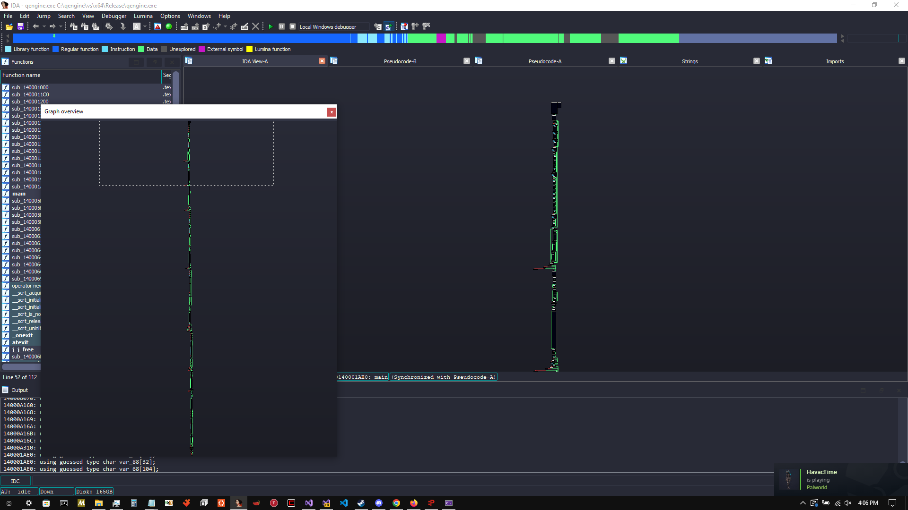

</details>

--------------------------------------------------------------------------------------------------------------------------------------------------------------------------------------------------------------

<details>
<summary>Compiler-specific Settings and Output</summary>

--------------------------------------------------------------------------------------------------------------------------------------------------------------------------------------------------------------
	
LLVM / CLANG and Intel Compiler always produce the best obfuscated output files and skewed control-flow graphs - Here are some examples all from the same basic application with only a main function (~20 lines of code using polymorphic types) :

## CLANG
  

## INTEL
  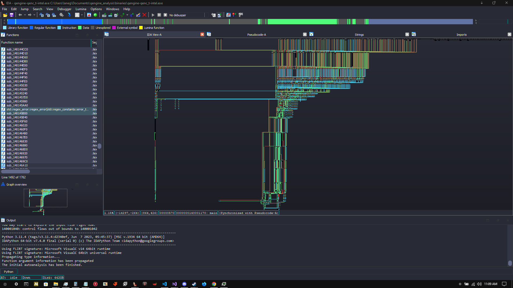

## MSVC
  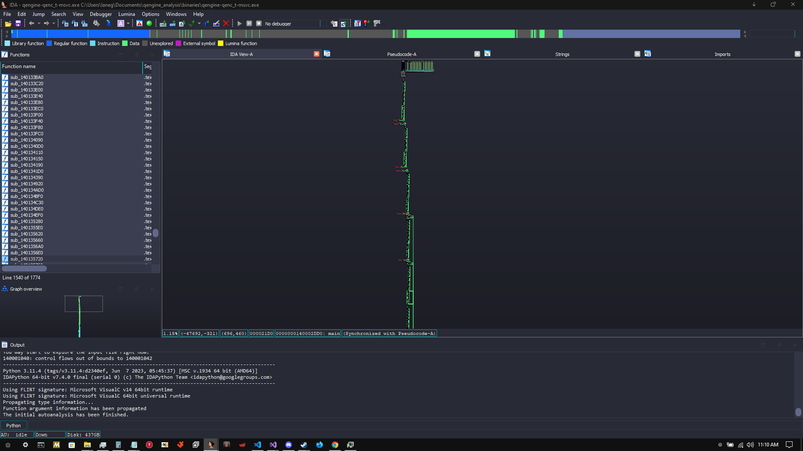


I am unsure as to exactly why this occurs when I use the same compiler settings for all of the above compilers, my experience would say that MSVC likely does not like to inline functions when you 
instruct it to, while CLANG / Intel compilers are more likely to listen to user commands/suggestions


* Proper compiler settings play a massive role in the output this library will produce.
- Make sure the binary is built for Release mode
- Here are the most important settings to use for maximum security (In VS 2022):

    

  </details>
  
--------------------------------------------------------------------------------------------------------------------------------------------------------------------------------------------------------------
<details>
<summary> " Hello World! " Source / Example </summary>

--------------------------------------------------------------------------------------------------------------------------------------------------------------------------------------------------------------

[Link to below sample project](https://github.com/Chemiculs/qengine-researchanddevelopment/tree/master/qengine-hello-world)

Here is the obligatory "Hello World" for qengine:

```cpp
#include <iostream>

#include <qengine/engine/qengine.hpp>

using namespace qengine;

 __singleton std::int32_t __stackcall main() noexcept {	//	explicit declarators are used as the point of this project is explicit communication with the compiler, however these are not required

	qtype_enc::qe_string my_string_e("Hello World!");

	qtype_hash::qh_string my_string_h("Hello World!");

	qtype_enchash::qeh_string my_string_eh("Hello World!");

	std::cout << my_string_e.get() << std::endl;

	std::cout << my_string_h.get() << std::endl;

	std::cout << my_string_eh.get() << std::endl;

	std::cin.get();
}
```

* All types contained in the qtype_enc and qtype_enchash namespace's are encrypted using a polymorphic encryption algorithm and decrypted only when accessed, then re-encrypted. 

* All types contained in the qtype_hash and qtype_enchash namespace's are hashed using a high-performance 32 or 64-bit hashing (dependent upon build target which is used) algorithm I made for this purpose.

</details>

--------------------------------------------------------------------------------------------------------------------------------------------------------------------------------------------------------------
<details>
<summary> Macros, Constants, Redefinitions </summary>

--------------------------------------------------------------------------------------------------------------------------------------------------------------------------------------------------------------

qengine contains some changes in representations to ideas and concepts in the C++ standard library, which were only intended to increase the readability of qengine in relation to the instructions prompted to the compiler.

* Below macro effectively disables inlining optimization for a specific function, if we wish for it to have a single instance per parent object, use in place of ``` __declspec(noinline) ```
```cpp
__singleton 	//	we only want a single instance of the declared fn per object instance, not instanced copies inlined to caller functions
```

* Below macro disables compiler generation of windows native SEH-related code in relation to the declared function whilst compelling the function to be inlined to the caller(s), use in place of ``` __forceinline ```
```cpp
__compelled_inline 	//	compell the highest inlining depth to the compiler 
```

* Below is a simple name change i made to declare the intention and effect that __fastcall convention actually has on the function more explicitly, it looks and sounds better to me personally. use in place of ``` __fastcall ```
```cpp
__regcall	//	pass up to two arguments through registers(?) if supported by OS bitwidth vs Variable type
```

* Below is another change to the naming of __cdecl convention for same reasons as above change
```cpp
__stackcall 	//	pass arguments on stack (too large to fit in registers presumably) / no arguments contained -  && allow caller to cleanup stack
```

* Below is an automatic type deduction i use for function return's myself, use in place of ``` decltype(auto) ```
```cpp
_auto_type_ 	//	automatic compiler-generated type-deduction for function returns (and variable declarations?), useful
```

* Below is a generic ctor optimization macro, presuming the ctor takes 1+ arguments which would fit inside registers matching or below the bitwidth of the host OS OR can be inlined. one of these will occur, use in place of ``` __compelled_inline_noseh ```, and  ``` __regcall ``` in combination.
```cpp
__optimized_ctor	//	this forces compiler optimization depending on the argument list, IF the function can be inlined it will be which is arguably the least expensive calling method, however if the compiler fails yet to inline, the argument will be passed through registers if the arguments match the bitwidth of the operating system
```

* Below is a simple grammar correction to the C++ standard library which should have occured long ago, declaring an inline function is a mere suggestion to the compiler and is explicitly stating that the compiler may inline the function only if it so chooses. nothing more or less than this, use in place of ``` inline ```
```cpp
__inlineable
```

* Below is a macro which, dependent upon project settings, will instruct the compiler to pass the arguments through SSE / AVX registers if available on Host CPU architecture. If SSE / AVX are unavailable, ```__fastcall``` will be specified rather than ```__vectorcall``` in the hopes that the floating point data matches or is under the host OS's bitwidth and can be optimized to fit inside a register.
```cpp
__fpcall
```
 
</details>

--------------------------------------------------------------------------------------------------------------------------------------------------------------------------------------------------------------
<details>
<summary> Windows SEH-based obfuscation and CXX EH-based obfuscation </summary>

--------------------------------------------------------------------------------------------------------------------------------------------------------------------------------------------------------------

Windows SEH (Structured Exception Handling) and Cxx EH (Exception Handling) mechanisms have been exploitable for some time and are relatively well known amongst the blackhat community for being an effecient method of mediocre obfuscation which is entirely compiler-generated

## Windows SEH-based obfuscation macro:

[Link to below sample project](https://github.com/Chemiculs/qengine-researchanddevelopment/tree/master/qengine-windows-SEH-test)
 
```cpp
//  Dereference a ring -3 pointer rather than call _CxxRaiseException() directly to avoid another import table entry
//  Basic SEH exception handling callback obfuscation, call WINAPI_SEH_INIT(); at beginning of scope && WINAPI_SEH_END() or ';' at the end of the scope and it will be executed from a statically compiled SEH table entry for x86_64, or SEH handled on stack for x86

WINAPI_SEH_INIT()	//	emplace @ fn beginning to displace the following code within a seperate and (somewhat) hidden windows SEH block inside your output PE

WINAPI_SEH_END()	//	push_back @ fn end to define an endpoint from which no more code inside of the parent fn will be displaced to windows SEH handler
```

To give a basic diagram of how windows SEH-based obfuscation functions under the hood, i built a (standard library) "Hello World" application with debug information and pdb included which encapsulated the entrypoint inside of this mechanism.

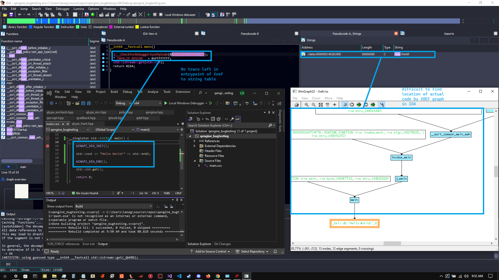

Windows SEH is actually a fairly effective obfuscation technique in it's own right if used properly, and while my macro implements a rather simple method of triggering it, this could be very easily made much more complex with your own adjustments. below is the closest i bothered going trying to reverse that sam[ple program with symbol / debug info present in IDA

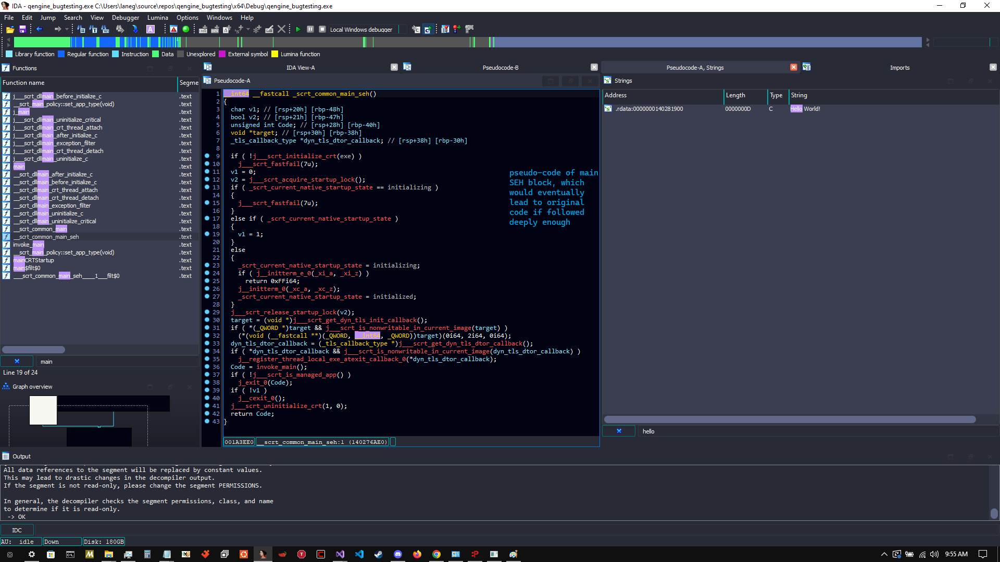

## CXX-EH based obfuscation macro:

[Link to below sample project](https://github.com/Chemiculs/qengine-researchanddevelopment/tree/master/qengine-CXX-EH-test)

This is considerably less secure than native windows SEH-based obfuscation while probably being more performant in CPU-intensive applications, this is a (standard library) "Hello World!" application nested within CXX-EH mechanisms w/ debug and symbol / PDB info in IDA:

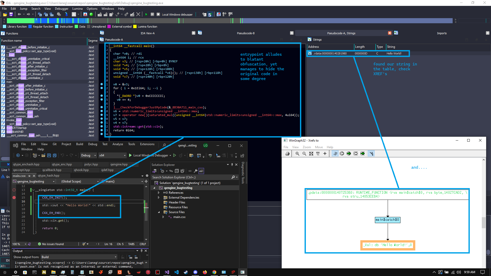

As you can see something is very obviously red-flaggish and 'off' about this entrypoint from the perspective of a reverse engineer, and this screams obfuscation and not very powerful at that. if we follow the XREF, we will be pointed directly to the original compiled code as opposed to with windows SEH this does not happen as easily:

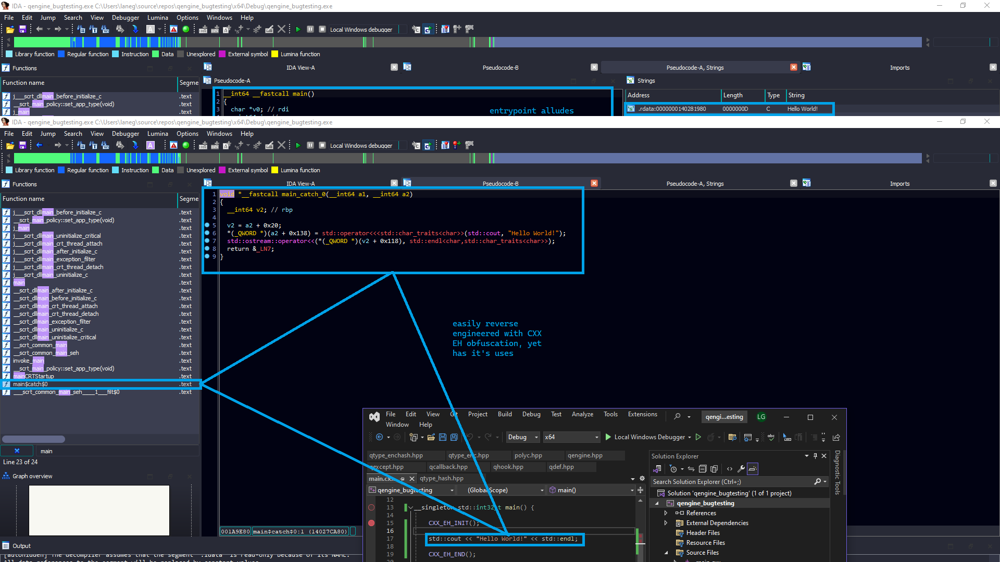

This could be easily cracked, however may be more performance-biased than windows SEH mechanisms and could probably be made to produce more complex output if modified beyond what has been done in qengine.

</details>

--------------------------------------------------------------------------------------------------------------------------------------------------------------------------------------------------------------

<details>
<summary>Cumbersome Conditional Branching</summary>

[Link to below sample project](https://github.com/Chemiculs/qengine-researchanddevelopment/tree/master/qengine-conditional-branching-test)

Here is an example of creating an obfuscated conditional branch that evaluates two variables for the specified condition, and executes the callback function corresponding to the outcome:

--------------------------------------------------------------------------------------------------------------------------------------------------------------------------------------------------------------

```cpp
#include <iostream>

#include <qengine/engine/qengine.hpp>

using namespace qengine;

static  __singleton void true_() noexcept {	//	callback functions shall never be inlined and should always be explicitly declared as a singleton point of execution, intentions are very important to know

	std::cout << "condition is true" << std::endl;
}

static  __singleton void false_() noexcept {	

	std::cout << "condition is false" << std::endl;
}


 __singleton std::int32_t __stackcall main() noexcept {

	int x = 1;
	int y = 1;

	qcritical::SCRAMBLE_CRITICAL_CONDITION(
		&true_,				// callback if condition evaluates to TRUE
		&false_,			// callback if condition evaluates to FALSE
		std::tuple<>{},     // arguments (if any) for TRUE evaluated callback (our callback has no arguments)
		std::tuple<>{},		// arguments (if any) for FALSE evaluated callback (our callback has no arguments)
		x, y,				// our condition variables from left -> right order (can be of any primitive type or std::string / std::wstring type for now)
		qcritical::EQUALTO  // evaluation type (less than, greater than, equal to, greaterthanorequalto etc. )
	);

	return 0;
}
```

The above program outputs "condition is true" to the screen - the above example is optimized in the release build, and if you want to see the real-world results on control flow this will have, you should use non-const comparison values e.g. time_since_epoch etc.

Let's do that below to give a better example of what is exactly happening with a non-const example:


Both programs above serve the same mathematical function and produce the same output, the one on the left built with qengine and the one on the right built using C++ standard operators/function calls.

Let's take a look at both of the above applications in IDA pseudo-code view (both are built Release x64, optimizations on, MSVC )

[Left = qengine, Right = std]
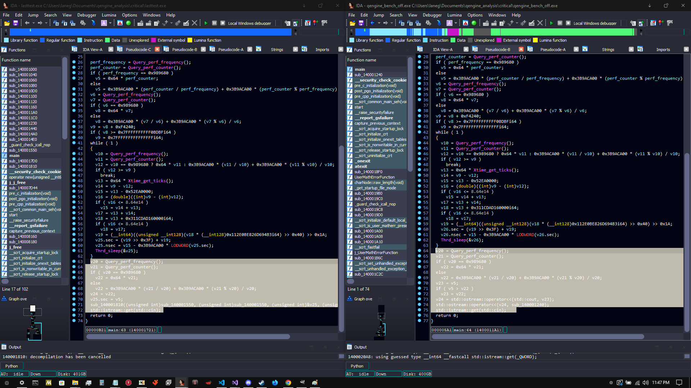

At first glance the entrypoint of both applications appear to be almost identical, with key differences I will highlight from the pseudo-code view and others from the raw assembly view -

* The conditional arithmetic in the std application all occurs within the entrypoint function, this will be highlighted in the next screenshot precisely using assembly-code view
  
* The conditional arithmetic in the qengine application is detoured to another subroutine, namely sub_140001810 which is compiled by taking callback arguments to the functions 'true_' and 'false_'

Below is the relevant region of machine code from both entry-point functions, which should reveal a JLE instruction (jump if lesser than or equal to), as this is the condition under which this program determines its functionality:

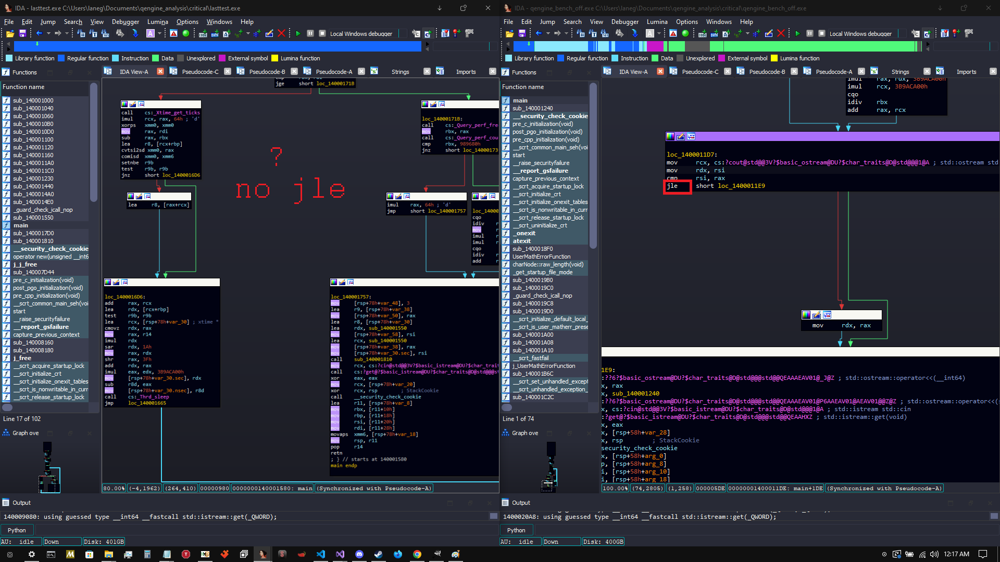

The std-compiled binary on the right, as expected, contains a JLE instruction plain as day. this, or the previous cmp instruction can be altered by a reverse engineer easily in a number of ways to manipulate the control flow of the application, or 'crack' it.

The qengine-compiled binary on the left, however, contains no such instruction. the instruction is detoured to sub_140001810, and inside of that subroutine, split into dozens of varying, complex comparison operators scattered amongst thousands of lines of obfuscated code.

A quick peak below at the pseudo-code view of both subroutines called from the std-compiled application (sub_140001240) (Right) and the qengine-compiled application(sub_140001810) (Left) :

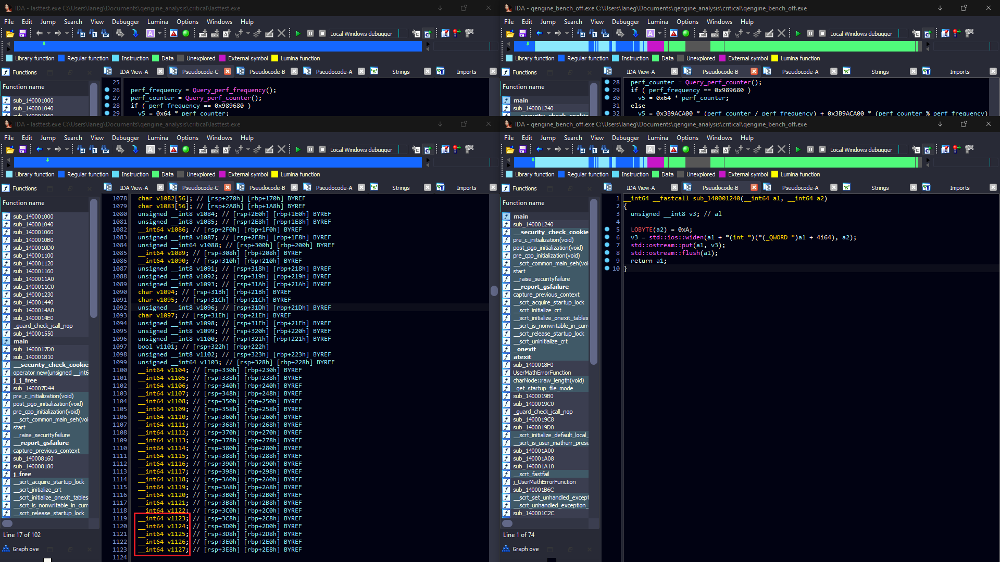

The std subroutine is easily identifiable as a standard output stream and is anything but complex in its appearance to a skilled reverse engineer.

The qengine-generated subroutine is (almost) incomprehensible - IDA generated 4726 lines of pseudo-code for the sub-routine, and attempted to allocate 1127 local variables on the stack - i wouldn't be having fun if i opened this application in IDA  looking to crack it.

Let's not be naive however - a thoroughly determined and highly skilled reverse engineer could theoretically spend hours/days or perhaps weeks/months reversing the subroutine and eventually find the critical cmp / test instructions, patch them out, and produce a working crack or modification of the application. 

There is no perfect fix for the issue of reversing - It boils down to a battle of which side can annoy the other the most.

## But couldn't I just NOP the call to sub_140001810 and bypass the security?

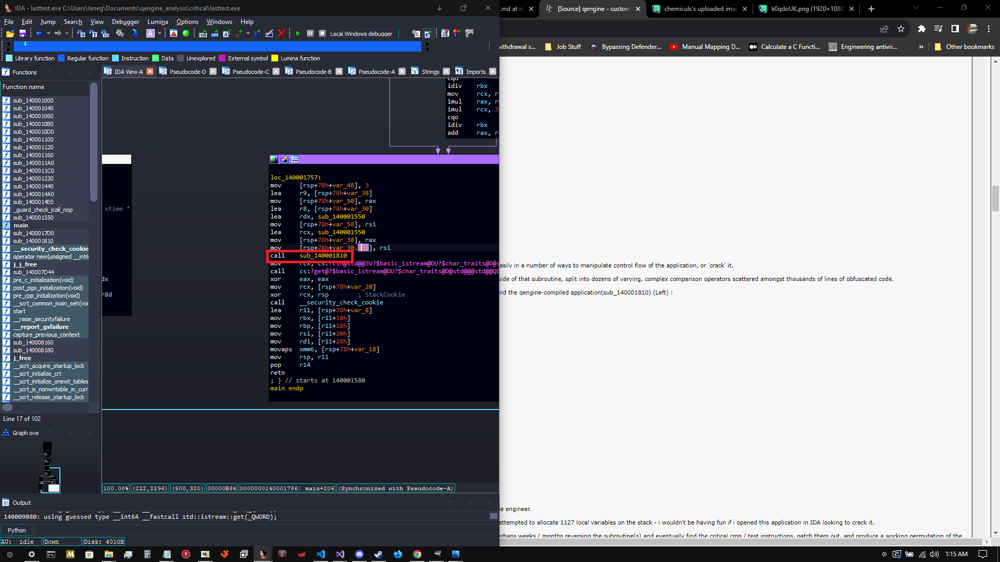

You could absolutely replace the call to sub_140001810 with an NOP or any other instruction, however with the above program, the consequences of doing so would be -

* Ceasing of further functionality ( if this was a product key input, for example, the program would fail to properly execute moving forward )
  
* You would have to go inside of sub_140001810 and patch the appropriate cmp / test / jmp instructions (all of which are hash-checked on the stack as well), in order to truly 'crack' the application in a manner which would preserve functionality, this is not a crackme but could easily be converted to one and would appear similar enough.

To demonstrate a basic cracking attempt by preventing the call to the subroutine, I opened up the binary in IDA and patched the call to sub_140001810


Now all that is left to do is run the patched binary and see if it produces usable output like the original -

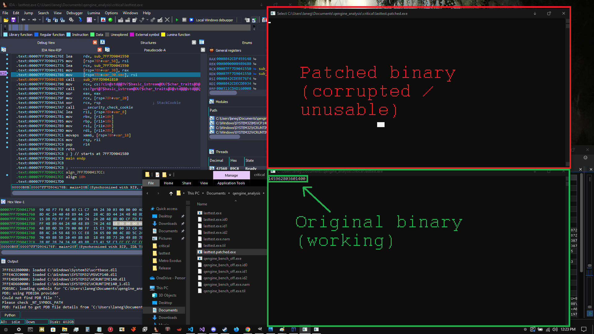

The 'patched' binary (which now fails to call the subroutine handling conditional callbacks), produces zero output. the program is in a broken and unusable state.

</details>

--------------------------------------------------------------------------------------------------------------------------------------------------------------------------------------------------------------

<details>
<summary>Memory-related Security, Hash-Checks, and Event Handlers</summary>

[Link to below sample project](https://github.com/Chemiculs/qengine-researchanddevelopment/tree/master/qengine-memory-integrity-test)

--------------------------------------------------------------------------------------------------------------------------------------------------------------------------------------------------------------

This library allows you to handle the event where a debugger or external tool attempts to illicitly write data to the stack/heap which corrupts/changes any of your variables. 

Below I will give an example of how to create a callback function to handle this event, assign it to the library, and trigger it yourself to test it -

```cpp

#include <iostream>

#include <qengine/engine/qengine.hpp>

using namespace qengine;

__singleton  void __regcall violation_callback(qexcept::q_rogueaccess except, void* data) noexcept {

	if (except.id != qexcept::MEMORY_ALTERATION) // ensure this callback has been raised due to memory alteration
		return;

	std::cout << "Memory access violation occurred, original hash: " << std::hex << except.original_hash << std::endl; // display the original hash of the data when it was valid

	std::cout << "Altered hash: " << std::hex << except.altered_hash << std::endl; // display the hash of the data which was altered

	std::cout << "Memory address: " << std::hex << reinterpret_cast<uintptr_t>(data) << std::endl; //display the memory address of the data which was altered 

	//Here you would normally flag the user for a ban/violation of contract or force-quit the application as a security breach has obviously occured
}


__singleton  std::int32_t __stackcall main() noexcept {

	qtype_enchash::init_qtype_hash(&violation_callback); // assign our callback function to the namespace - all instances will refer to this callback if they detect a violation

	qtype_enchash::qeh_int32 MyInteger(999); // instance a hash-checked integer and set its value to 999

	(*static_cast<std::uint32_t*>(MyInteger.get_raw_memory_address())) = 998; // use the built-in illegal-accessor for this example to modify the value of the data and trigger our callback

	int32_t value = MyInteger; // store the value held within MyInteger in a normal primitive variable to invoke get() (get() is when the check will occur)

	std::cout << "Hacked value: " << value << std::endl; // print the new / hacked value to the screen (998)

	std::cin.get();

	return 0;
}

```

Below is a screenshot of the resulting output from the above code:


</details>

--------------------------------------------------------------------------------------------------------------------------------------------------------------------------------------------------------------

<details>
<summary>PE Header Manipulation && Executable Section Polymorphism</summary>

[Link to below sample project](https://github.com/Chemiculs/qengine-researchanddevelopment/tree/master/qengine-pe-manipulation-test)

--------------------------------------------------------------------------------------------------------------------------------------------------------------------------------------------------------------

This library can disrupt the ability to signature scan the executable sections of the PE file in memory / from memory dumps, and corrupt + wipe the header information (it would need to be rebuilt to properly parse through PE-bear / CFF explorer etc.)

Below is an example of how to mutate the executable sections of the PE and scramble the header information:

```cpp
#include <iostream>

#include <qengine/engine/qengine.hpp>

using namespace qengine;

__singleton  std::int32_t __stackcall main() noexcept {

	// You do not have to use all of the below functions, however analyze_executable_sections() must be called before morph_executable_sections(), and this must be called before manipulating headers as it depends on information from the headers to perform analyzation

	qdisasm::qsection_assembler sec{ };

	sec.analyze_executable_sections();

	if (sec.morph_executable_sections(true)) // NOW we morph our stored sections and pass true to flag for memory clearance 
		std::cout << "Interrupt Padding morphed successfully! " << std::endl;
	else
		std::cout << "Interrupt Padding failed to be morphed! " << std::endl;

	if (sec.zero_information_sections())
		std::cout << "Garbage sections nulled" << std::endl;
	else
		std::cout << "Garbage section wipe failed" << std::endl;

	if (sec.scramble_dos_header(true))
		std::cout << "DOS headers wiped" << std::endl;
	else
		std::cout << "DOS headers not wiped" << std::endl;

	if (sec.scramble_nt_header())
		std::cout << "NT headers wiped" << std::endl;
	else
		std::cout << "NT headers not wiped" << std::endl;
	
	std::cout << ".text / header permutations complete!" << std::endl;

	std::cin.get();
}
```

The above code will complete successfully and without errors, there are instances where the section header manipulation will, however, cause the Visual Studio debugger to trigger exceptions if is attempting to read data from any of the altered sections (this does not matter as you won't be publishing a debug build of your application anyways if you are concerned about security)

Below are examples, before and after the above functions are called, of the PE headers and .text section of an executable

## Headers before scramble:


## Headers after scramble:


Some fields such as e_magic in the DOS header and SizeOfStackCommit / SizeOfStackReserve fields in the optional header must be preserved as the application will crash otherwise.

## .text section before scramble:


## .text section after scramble:


I cannot show the whole .text section in one screenshot, so I tracked down a section above from a memory dump that was mutated (note that there are generally hundreds or thousands of these regions which will be mutated depending on the symbol count/complexity of the binary).

The interrupt padding (0xCC / INT3 on x86 PE files) between symbols is being tracked and permutated to change the appearance of the executable section in memory.

The INT3 paddings ( 0xCC arrays) are regions that the instruction pointer never hits, so they are (almost) safely mutable to any form, the engine now mutates these regions to random executable machine code which will make it extremely hard to determine where a function/subroutine ends, and which code is valid and executed.

</details>

--------------------------------------------------------------------------------------------------------------------------------------------------------------------------------------------------------------

<details>
<summary>Runtime Imports</summary>

[Link to below sample project](https://github.com/Chemiculs/qengine-researchanddevelopment/tree/master/qengine-runtime-imports-test)

--------------------------------------------------------------------------------------------------------------------------------------------------------------------------------------------------------------

This library allows you to manually load API libraries at runtime and invoke them from their imported address - This prevents the names of the libraries and functions you are using in your application from being included on the import table of your PE.

Below is an example of importing a Windows API function using the import tool -

```cpp
#include <iostream>

#include <qengine/engine/qengine.hpp>

using namespace qengine;

__singleton  std::int32_t __stackcall main() noexcept {
	// Return type is NTSTATUS (template parameter)
	// Argument 1 is the library name (wide / ansi char depend on charset)
	// Argument 2 is name of function or ordinal number
	// all following arguments correspond to the API functions args themselves

	auto status = qimport::qimp::invoke<NTSTATUS>(L"user32.dll", "MessageBoxA", NULL, "Hello World", "Hello World", NULL);

	std::cin.get();
}
```

As you can see below, this yields the expected result from calling MessageBoxA with the according arguments:

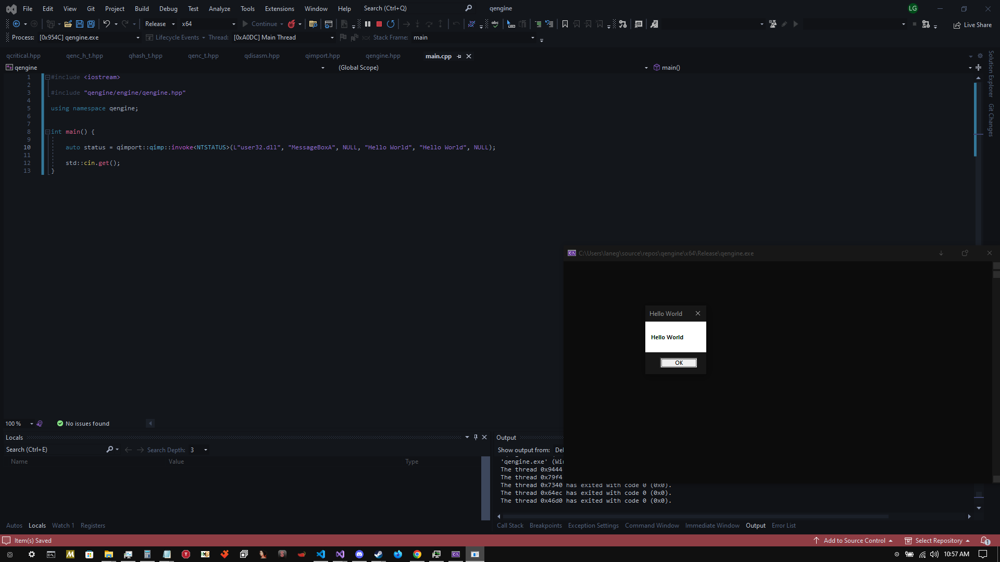

If you do not want the overhead of GetProcAddress() being called repeatedly, I have added the ability to store the imported function bound to its prototype as a local or global object which can be directly invoked for a small performance gain 
(I have not checked myself, but I doubt the compiler will know precisely what we are doing and will perform an Export Table lookup at every GetProcAddress() call).

This is useful if you are calling the imported function in a loop or by any other means calling it repeatedly, below is an example specific to this use case :

```cpp

#include <iostream>

#include <qengine/engine/qengine.hpp>

using namespace qengine;

/* First template argument specifies return type, subsequent template arguments specify argument type list in Left -> Right order for the fn being imported */
static auto imp_MessageBoxA = qimport::qimp::get_fn_import_object<NTSTATUS, unsigned int, const char*, const char*, unsigned int>(L"user32.dll", "MessageBoxA");

__singleton  std::int32_t __stackcall main() noexcept {

	auto status = imp_MessageBoxA(NULL, "Hello World!", "Hello World!", NULL); // call MessageBoxA and assign it's status return to a local 

	std::cout << status << std::endl; // output the return status to the console 

	std::cin.get(); 
}

```

</details>

--------------------------------------------------------------------------------------------------------------------------------------------------------------------------------------------------------------
<details>
<summary> Inline Function Hook Scanning </summary>

[Link to below sample project](https://github.com/Chemiculs/qengine-researchanddevelopment/tree/master/qengine-hookscanner-test)

--------------------------------------------------------------------------------------------------------------------------------------------------------------------------------------------------------------

People developing certain applications, namely Video Games, struggle with internal game cheats (DLL injection). These cheats (internal) and sometimes external cheats, will hook / detour certain important functions inside of the game/application in order to manipulate output and obtain an advantage or 'crack' certain features of the application.

Detours are generally speaking, simple blocks of machine code 12+ bytes in length which are placed at a functions address in memory, in order to redirect control flow of the function outside of the main module, and into the malicious module.

here is an example of a most basic detour function in X86 assembly 

```asm
mov rax, 0xDETOUR_ADDRESS    ; move an immediate value ( address of the function we want to execute instead of the original ) into the RAX register
jmp rax                      ; move the instruction pointer to the address held in the RAX register
```

Detecting these hooks can be a non-trivial task depending on the complexity of the hook -

I have implemented a rather basic implementation of a hook scanning class inside of qengine in the latest update, the class uses a separate thread to efficiently scan methods in memory for the placement of hooks inside of the method's body.

The thread searches for control flow transfer instructions (ret, jmp, call namely), and when these are found, it checks if the address to which control flow is being transferred is within the module's address space.
If not, this likely means a hook has been placed on the method and that your security measures have been breached.

Below is an example application that initializes the hook-detection library, and references the designated callback function to it. After this, an example hook is placed at the functions address in memory to demonstrate detection by our library :

```cpp
#include <iostream>

#include <qengine/engine/qengine.hpp>

using namespace qengine;

static __singleton  void __regcall myimportantmethod(long long val) noexcept { // add junk code to our dummy method to increase it's size in memory to be viable for hook placement

	auto j = std::chrono::high_resolution_clock::now().time_since_epoch().count();

	auto k = j % val;

	std::cout << k << std::endl;
}

__singleton  void __stackcall callback(qexcept::q_fn_alteration alteration) noexcept {	//	callbacks are never inlined nor inlineable, therefore in this example i am explicitly declaring these things

	if (alteration.id != qexcept::HOOK_DETECTED)
		return;

	auto casted_arg = reinterpret_cast<qhook::qhook_detection_t*>(alteration.violation_object_);

	std::cout << "Function hook detected, address: " << std::hex << casted_arg->hook_address << "\n";
	std::cout << "Hook size: " << casted_arg->hook_length << "\n";
	std::cout << "Hook data: " << std::endl;

	for (auto i = 0; i < casted_arg->hook_length; ++i)
		std::cout << std::hex << (int)casted_arg->hook_data[i] << "\n";

	delete casted_arg; // thi was allocated with new, must be deleted inside callback to avoid memory leak
}

__singleton  std::int32_t __stackcall main() noexcept {

	std::cout << "initializing hook scanner..." << std::endl;

	qhook::qhook_t::set_client_callback_fn(&callback);

	qhook::qhook_t((void*)&myimportantmethod);

	// any of the below hooks will be detected - you could change the registers used etc. if you wanted to

	unsigned char hook1[12] = {
		0x48, 0xB8, 0x11, 0x11, 0x11, 0x11, 0x11, 0x11, 0x11, 0x11, 0xFF, 0xE0 // mov rax, 0x1111111111111111 ; jmp rax
	};

	unsigned char hook2[14] = { // this is a trash hook used to test features of the detection, push rax, pop rax is a NOP essentially
		0x48, 0xB8, 0x11, 0x11, 0x11, 0x11, 0x11, 0x11, 0x11, 0x11, 0x50, 0x58, // mov rax, 0x1111111111111111 ; push rax ; pop rax ; jmp rax
		0xFF, 0xE0
	};

	unsigned char hook3[12] = {
		0x48, 0xB8, 0x11, 0x11, 0x11, 0x11, 0x11, 0x11, 0x11, 0x11, 0x50, 0xC3 // mov rax, 0x1111111111111111 ; push rax ; ret
	};

	myimportantmethod(4);

	std::cout << "emplacing hook..." << std::endl;

	auto* ptr = (void*)&myimportantmethod;

	DWORD tmp{};

	VirtualProtect(ptr, sizeof(hook2), PAGE_EXECUTE_READWRITE, &tmp);

	memcpy(ptr, &hook2, sizeof(hook2));

	VirtualProtect(ptr, sizeof(hook2), tmp, &tmp);

	std::cin.get();

	return 0;
}
```

Here is the output when we execute the above application :

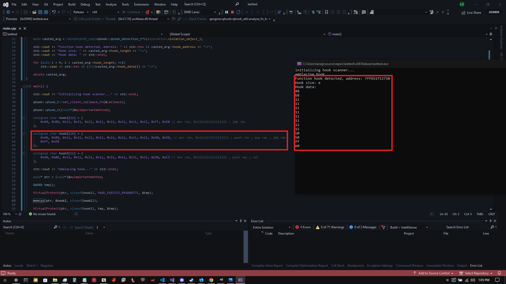

I have with the rather brief testing period I have subjected this to, been unable to cause false-positive detections. Anyone willing to test this library to a greater extent to see if they can break it, would be beyond helpful.

</details>

--------------------------------------------------------------------------------------------------------------------------------------------------------------------------------------------------------------

<details>
<summary> Notes </summary>

--------------------------------------------------------------------------------------------------------------------------------------------------------------------------------------------------------------

* You must target C++ 17 or higher as your language standard for the library to compile properly

* Manipulating header info and morphing executable section will likely break virtualization tools such as VMProtect and Themida as they rely on and / or manipulate this information themselves depending on user settings - I have not thoroughly tested this, however.

* Extended types (SSE / AVX) must be enabled in your project settings if you wish to use the derived polymorphic versions of them.

* All heap-allocated types such as qe_malloc, qeh_malloc, and qh_malloc will automatically free their own memory when they go out of scope, however keep in mind that reading variable length memory with their according get() accessor will return new memory allocated with malloc() which you must free yourself.

* While this library works for all of the compilers I will mention, MSVC produces the least complex control-flow graphing as a compiler and would be the easiest output to reverse-engineer (i'm talking to you M$), do yourself a favor and use LLVM / Clang or Intel's compiler

</details>

--------------------------------------------------------------------------------------------------------------------------------------------------------------------------------------------------------------

<details>
<summary> Credits </summary>

--------------------------------------------------------------------------------------------------------------------------------------------------------------------------------------------------------------

* Huge thank you to the [Capstone Project](https://github.com/capstone-engine/capstone) for making many parts of this library feasible and providing an excellent disassembly library in general

* Another huge thank you to the [ASMJIT Project](https://github.com/asmjit/asmjit) for making machine code generation at runtime a feasible prospect for this project

* [HadockKali](https://github.com/HadockKali) ( For helping with this Readme )

* [javaloader's SkyCrypt](https://github.com/javaloader/Sky-Crypt-C-11-String-Encryptor-) - Although this project appears unlicensed, everything in the QSTR header is heavily based off of this project, mostly i changed naming conventions and optimized / changed some of the code to fit qengine's theme. His repo deserves a star or two.

* My dear friend [slow-call](https://github.com/slow-call), whom has helped me with generating ideas for this project from it's inception and whom also helped create the beautiful icon which qengine now bears.

Licenses for both respective libraries are included in the repo and must be upheld.

</details>

--------------------------------------------------------------------------------------------------------------------------------------------------------------------------------------------------------------

<details>
<summary> Contributing to qengine </summary>

--------------------------------------------------------------------------------------------------------------------------------------------------------------------------------------------------------------

qengine has a separate repository available, which contains the current official Research, Development, and Security testing tools available for the engine - 

[ qengine Research & Development ](https://github.com/Chemiculs/qengine-researchanddevelopment)

## - Bug Testing / Debugging

I am one person and only have so much time on my hands, and i have other projects i am working on + an unrelated IRL job. 

I may be fairly effecient at pumping out code, but i am left with even less time to do the in-depth debugging, reversal and documentation on this project which i would like to achieve for this project ultimately. 

I wouldn't mind help to get there, so if you encounter any bugs please submit a report.

## - Ideas / Collaborators

I'm always looking for new ideas for the future of this project, and most certainly could use some more experienced hands writing this code with me.
If you think of something you would like to see in qengine, or would like to contribute in any way, my Discord is listed below.

</details>

--------------------------------------------------------------------------------------------------------------------------------------------------------------------------------------------------------------

<details>
<summary> Donations </summary>

--------------------------------------------------------------------------------------------------------------------------------------------------------------------------------------------------------------

This is free software and i am not trying to charge you for it, however If you do wish to support the project or leave a thanks by donating, below are links through which you may donate if you so choose (And thank you very much if you do!) -

- [CashApp](https://cash.app/$0xH4X0R)

- [Paypal](https://paypal.me/CoDTroll?country.x=US&locale.x=en_US)

- Bitcoin -
bc1qx9xsw4hvvqel29au5xy3vqwh48u0yhvsxfsd33

- Litecoin -
ltc1q0jqcsf83xjqx5x9cj2wag06hpwxc6sv3wczu6v

- Ethereum -
0x7457875998B35A032c789a10177Bb463fF2F1902

- Dogecoin -
D5NTFpffw9erwdEbnz7rymBhkgrRzfEigs

</details>

--------------------------------------------------------------------------------------------------------------------------------------------------------------------------------------------------------------

I don't have much time on my hands at the moment. I am passionate about this project and can see it has a very bright future, however due to Economic / Employment issues, i spend nil time recently working on programming.

Feel free to submit any bugs with the library you find, and I encourage you to contribute to the project if you enjoy it or find any use for it yourself.

# If you have any Questions or Inquiries regarding qengine, feel free to contact me on Discord:


<p align="center" style="font-size: 20px; font-weight: bold;">
                                         		0xH4X0R#0390 
</p>
